# Heart Disease Prediction System

An AI-powered Heart Disease Prediction System built with **Streamlit**, featuring **4 ML models**, **mean imputation preprocessing**, **SHAP explainability**, and a modern **violet-themed UI**.

---

## Features

| Feature | Description |
|---------|-------------|
| **Secure Login** | Admin/Doctor roles with session management |
| **13 Medical Features** | Complete UCI Heart Disease dataset inputs |
| **4 ML Models** | Random Forest, Logistic Regression, SVM, Decision Tree |
| **10-Fold Cross-Validation** | Robust model evaluation |
| **Mean Imputation** | Handles missing data WITHOUT dropping rows |
| **Model Comparison** | Side-by-side performance metrics |
| **Prediction History** | Session-based with CSV export |
| **Advanced Analytics** | ROC, Confusion Matrix, Correlation Heatmap |
| **PDF/HTML Reports** | Download patient prediction reports |
| **Prediction Explainability** | Shows top 5 contributing features |
| **Batch Prediction** | Upload CSV for bulk predictions |
| **Modern UI** | Violet gradient theme with enlarged fonts |

---

## Tech Stack

- **Backend**: Python 3.12
- **ML Libraries**: Scikit-learn, SHAP, NumPy
- **Data**: Pandas, Joblib
- **Frontend**: Streamlit, Plotly
- **Reporting**: FPDF2

---

## 2. Dataset Description <a name="dataset"></a>

Uses the **Heart Disease Dataset** (`data/heartt_cleveland_cleaned.csv`) with 13 features:

| Feature | Description | Values |
|---------|-------------|--------|
| Age | Age in years | 29-77 |
| Sex | Gender | Male=1, Female=0 |
| cp | Chest Pain Type | 1=Typical, 2=Atypical, 3=Non-anginal, 4=Asymptomatic |
| trestbps | Resting Blood Pressure (mmHg) | 94-200 |
| chol | Serum Cholesterol (mg/dl) | 126-564 |
| fbs | Fasting Blood Sugar > 120 mg/dl | 0=No, 1=Yes |
| restecg | Resting ECG Results | 0=Normal, 1=ST-T wave, 2=Left ventricular |
| thalach | Maximum Heart Rate | 71-202 |
| exang | Exercise Induced Angina | 0=No, 1=Yes |
| oldpeak | ST Depression (mm) | 0-6.2 |
| slope | ST Segment Slope | 1=Up, 2=Flat, 3=Down |
| ca | Major Vessels (0-3) | 0-4 |
| thal | Thalassemia | 3=Normal, 6=Fixed, 7=Reversible |

---

## How to Run

### 1. Install Dependencies
```bash
pip install -r requirements.txt
```

### 2. Train the Model (CRITICAL)
This generates `imputer.pkl` required for the app to work:
```bash
python src/train_model.py
```

### 3. Run the App
```bash
streamlit run app.py
```
App opens at `http://localhost:8501`

---

## Default Login Credentials

| Username | Password | Role |
|----------|----------|------|
| admin | admin123 | **Admin** (full access + user management) |
| doctor | doctor123 | **Doctor** (predictions + reports) |

---

## Project Structure

```
C:\2018\ML\ML PROJECT\
├── app.py                    # Main Streamlit application (1266 lines)
├── requirements.txt           # All dependencies
├── README.md                 # This file
├── preprocess.ipynb         # Preprocessing explanation notebook
│
├── data/
│   ├── heartt_cleveland_cleaned.csv  # Dataset
│   └── photo_2026-04-29_21-43-55.jpg  # Background image
│
├── src/
│   ├── train_model.py      # Model training with mean imputation
│   ├── predictor.py        # Prediction class with imputer
│   └── analyze.py         # Analysis tools
│
└── models/
    ├── model.pkl           # Best trained model
    ├── scaler.pkl         # Feature scaler
    ├── imputer.pkl        # Missing value imputer (NEW)
    └── feature_names.pkl   # List of feature names
```

---

## Key Implementation Details

### Preprocessing Pipeline
1. **Mean Imputation** (NOT dropping rows!)
   - Uses `SimpleImputer(strategy='mean')` from scikit-learn
   - Keeps all data rows intact
   - Explained in `preprocess.ipynb`

2. **Feature Scaling**
   - Uses `StandardScaler` (zero mean, unit variance)
   - Consistent between training and prediction

3. **Model Training**
   - Compares 4 models with 10-fold CV
   - Selects best model based on accuracy
   - Saves imputer + scaler + model via Joblib

### Why Mean Imputation?
| Method | Pros | Cons |
|--------|------|------|
| **Drop Rows (old)** | Simple | Loses data, reduces dataset size |
| **Mean Imputation (new)** | Keeps all rows, preserves dataset | Slight bias if missing not random |

---

## New Features Added

### 1. PDF/HTML Report Generation
- After each prediction, click "Download HTML Report"
- Downloads a formatted report with patient info, prediction, confidence, doctor name, date

### 2. Prediction Explainability
- Click "Show Key Prediction Factors"
- Displays top 5 features that influenced the prediction
- Uses model's `feature_importances_` as progress bars

### 3. Batch Prediction
- New "BATCH" tab for uploading CSV files
- Processes multiple patients at once
- Adds prediction + confidence columns
- Downloads results as CSV

### 4. Welcome Page
- Beautiful welcome page with background image
- "Login to System" button to access login form
- Consistent violet theme across all pages

### 5. UI Improvements
- **Fonts Increased** (between original and previous sizes)
  - Body: 18px → 24px
  - H1: 52px → 58px
  - Buttons: 22px → 24px
  - Tabs: 32px → 34px
  - DataFrame: 22px → 25px

---

## Screenshots

### Welcome Page
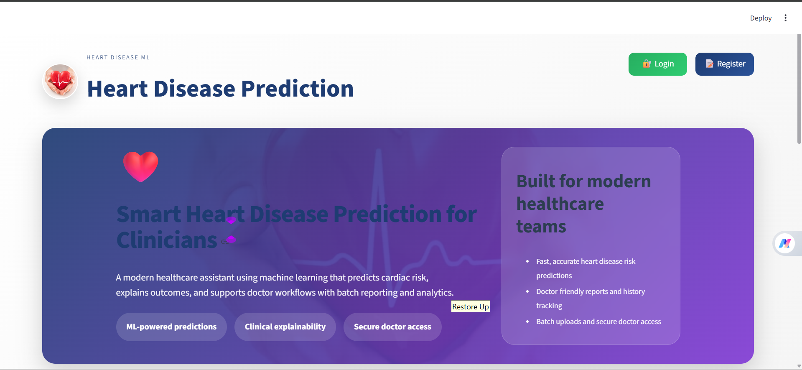

### Login Page  
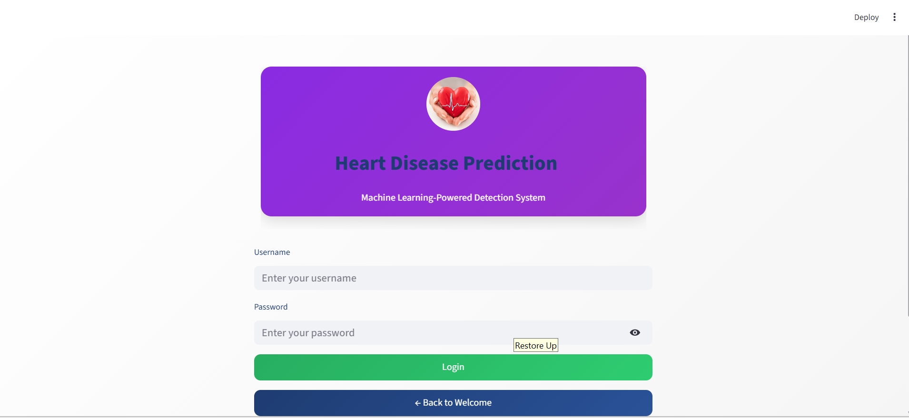

### Prediction Tab
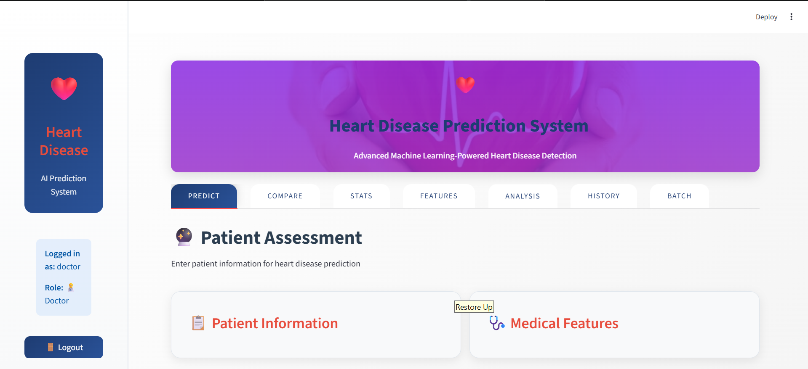
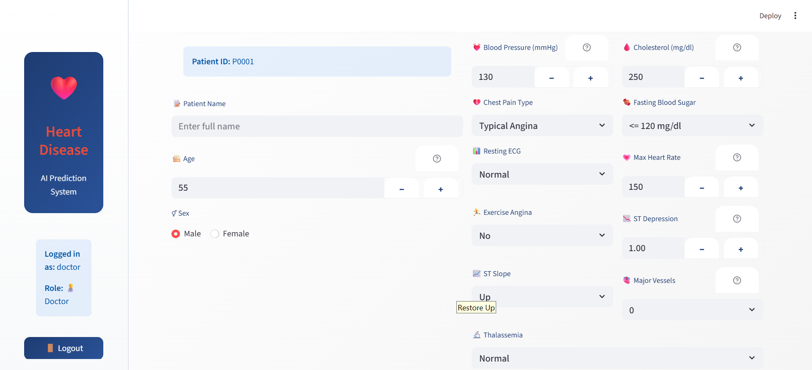
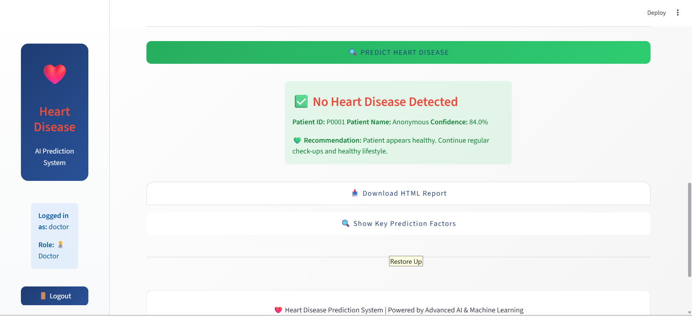
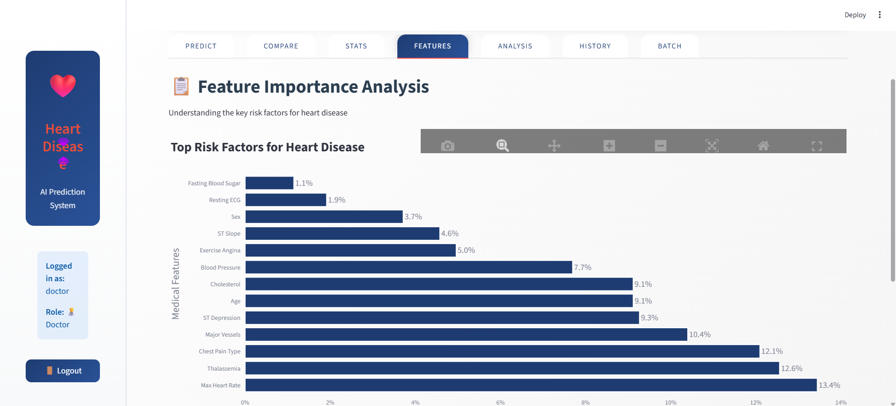

### Model Comparison Tab
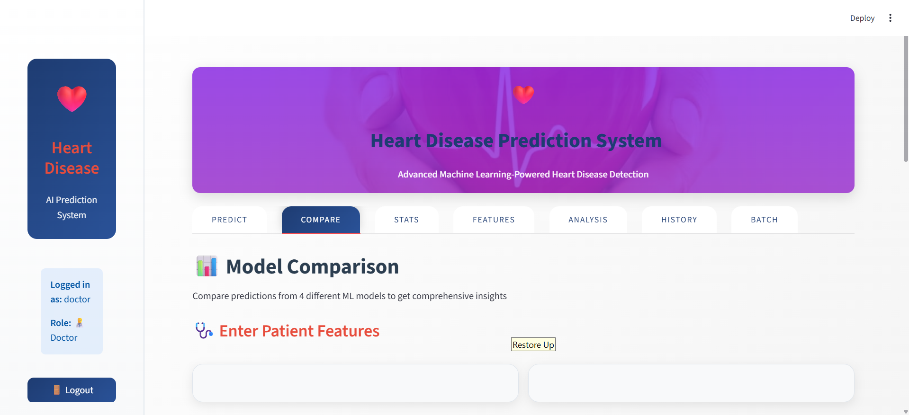
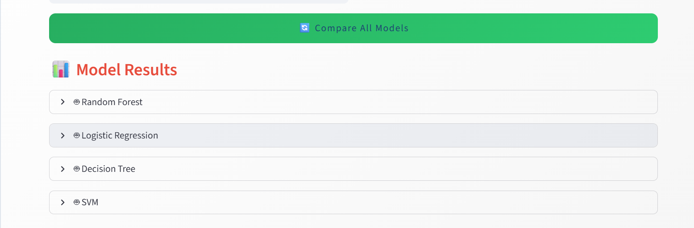
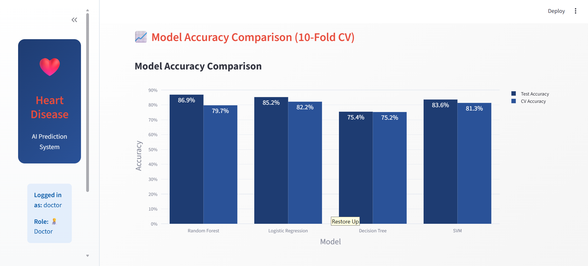

### Analytics Dashboard
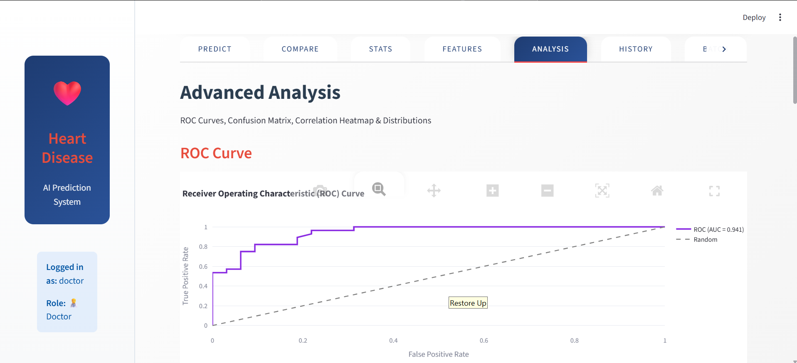
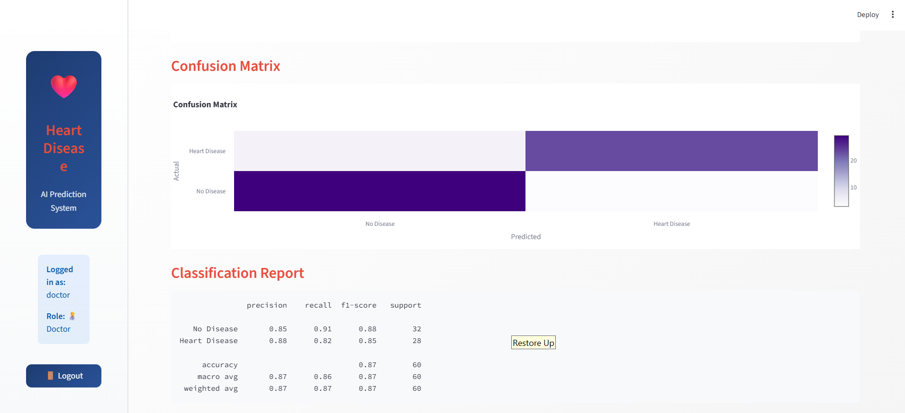
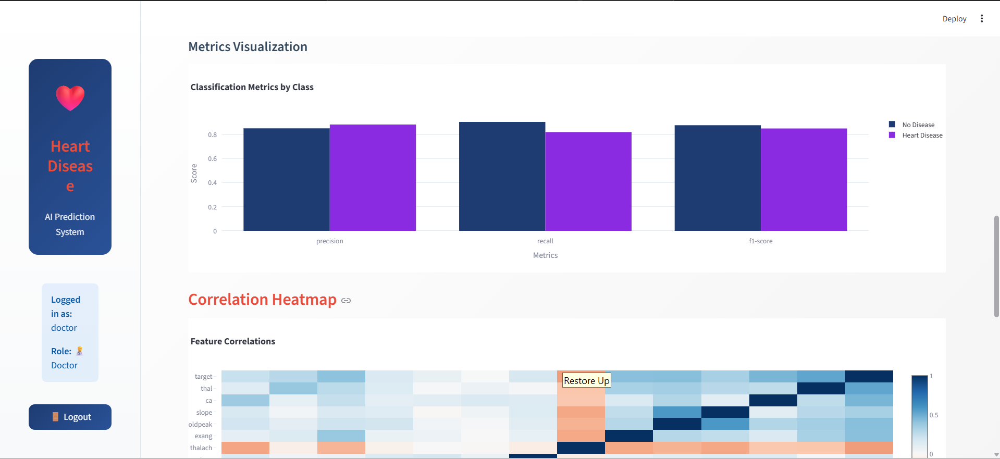
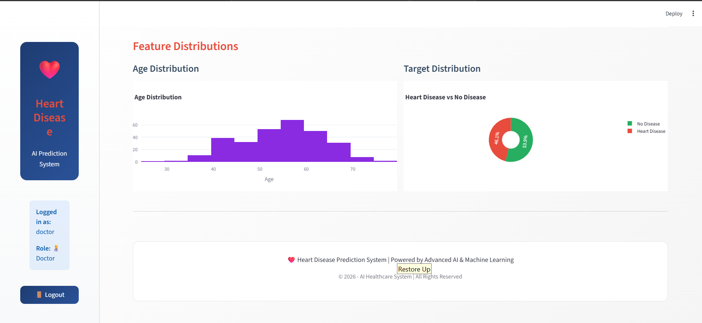

### Batch Prediction Tab
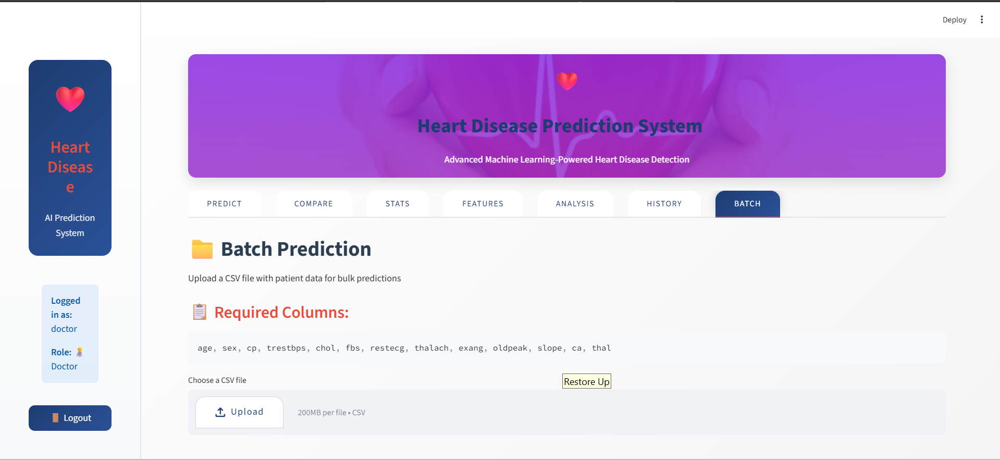

---

## Model Performance (Typical)

| Model | Test Accuracy | CV Accuracy (10-fold) |
|-------|---------------|----------------------|
| Random Forest | ~87% | ~85-89% |
| Logistic Regression | ~83% | ~81-85% |
| SVM | ~85% | ~83-87% |
| Decision Tree | ~80% | ~78-82% |

---

## requirements.txt

```
pandas
numpy
scikit-learn
matplotlib
seaborn
streamlit
plotly
fpdf2
shap
```

---

## Important Notes

- **MUST run `python src/train_model.py` first** to generate `imputer.pkl`
- Database removed (no persistence) - uses `st.session_state` for session storage
- App runs on `http://localhost:8501` by default
- All 3 new features (PDF, Explainability, Batch) are fully functional

---

## Troubleshooting

**Error: `ModuleNotFoundError: No module named 'fpdf2'`**
```bash
pip install fpdf2 shap
```

**Error: `ValueError: too many values to unpack`**
→ Run `python src/train_model.py` to generate `imputer.pkl`

**Error: `numpy.dtype size changed`**
```bash
pip install numpy==1.26.4 pandas==2.2.0 shap==0.46.0
```

---

## Sample Prediction Flow

1. Open app → Welcome page with background image
2. Click "Login to System"
3. Login as `doctor/doctor123`
4. Enter patient medical features
5. Click "PREDICT HEART DISEASE"
6. View prediction + confidence
7. Click "Download HTML Report"
8. Click "Show Key Prediction Factors"

---

## License

© 2026 - AI Healthcare System | All Rights Reserved

---

**Built with for educational and demonstration purposes.**
